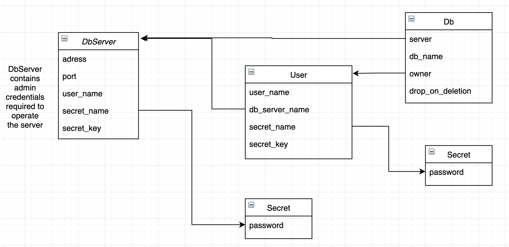
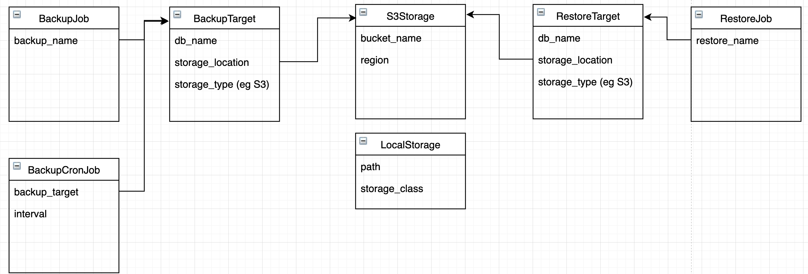

# db-operator

This is a redesign of my first attampt to make a database operator: https://github.com/kabisa/postgresdb-operator

The goal of this operator is to provide databases for preview environments. It expects that there's already a `DbServer` available. This operator does not and (in the foreseable future) will not create Database Servers, RDS instances or absolve you of your DBA duties.

## Why rewrite the old operator?

Mainly:
- Ansible was slow. Every step in Ansible takes quite some time. And there were quite a few steps to go through with ansible. Golang however is a lot faster. Ansible was resource heavy. Golang is lean and nimble.
- I learned that Ansible, and in particular `Yaml`, is not well suited to implement logic. It's great that I didn't have to think about how to apply the required changes in Postgres. But what was really painful was to gather state information and make reconcilation decisions.

But also:
- I wanted a good project to learn Golang
- I believe preview environments are important
- By using the name `DbOperator` I give myself the option to support other Databases as well in the future. For now however, the code does not support different databases.
- I thought it was a cool project to do (still do)

## Design

### Databases Diagram [ready / beta -ish]



### Backup Restore Diagram




### Building

```
make docker-build
make single-file-deploy
```